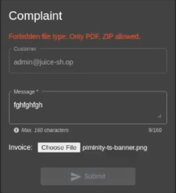
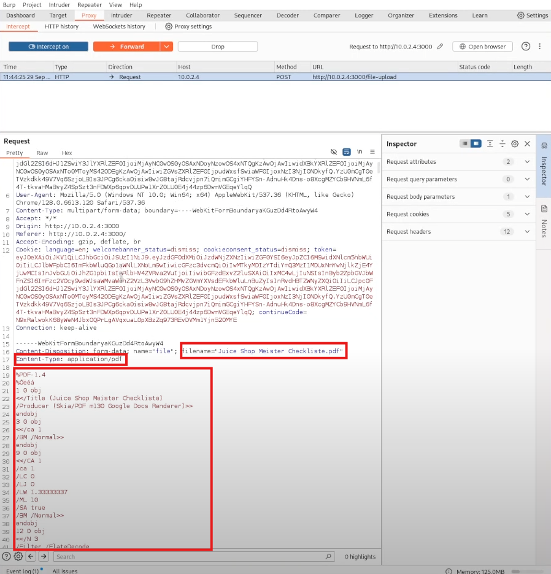
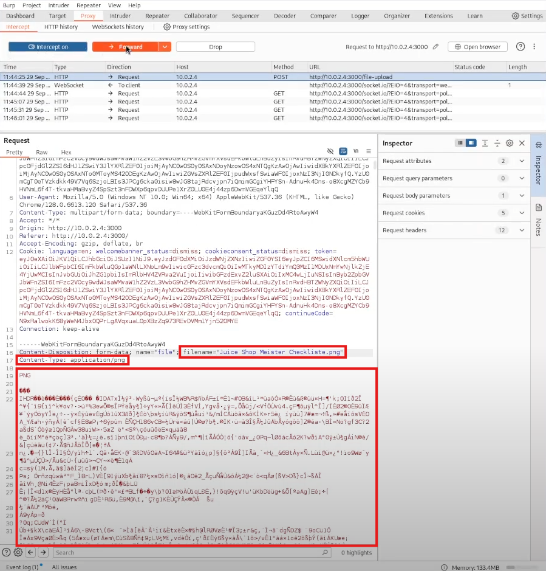

# OWASP Juice Shop Hacking: File Upload Manipulation Exploit

## Table of Contents

1. [Challenge Overview](#challenge-overview)
2. [Solution Steps](#solution-steps)
   - [Step 1: Go to Complain Section](#step-1-go-to-complain-section)
   - [Step 2: Try to Upload PNG or JPEG File](#step-2-try-to-upload-png-or-jpeg-file)
   - [Step 3: Manipulate File Upload in Burp Suite](#step-3-manipulate-file-upload-in-burp-suite)
   - [Step 4: Modify File Type in Request](#step-4-modify-file-type-in-request)
   - [Step 5: Complete the Challenge](#step-5-complete-the-challenge)
3. [Video Tutorial](#video-tutorial)

## Challenge Overview

This challenge involves manipulating the file upload functionality in OWASP Juice Shop to bypass restrictions on allowed file types. The goal is to upload a non-allowed file type by modifying the request headers.

## Solution Steps

### Step 1: Go to Complain Section

- Navigate to the "Complain" section in OWASP Juice Shop.
- Normally, only PDF or ZIP files are accepted for upload.
- Attempt to upload a PNG file, but you will find that it doesn't work.

### Step 2: Try to Upload PNG or JPEG File

- Try uploading a JPEG or JPG file to see if it is accepted by the system.

### Step 3: Manipulate File Upload in Burp Suite

- Open Burp Suite and intercept the upload request.
- Prepare to upload a default PDF file through the complain form.

### Step 4: Modify File Type in Request

- Before sending the request, intercept it in Burp Suite.
- Modify the following parameters:
  - Change the file type from `application/pdf` to `application/jpeg`.
  - Change the file extension from `.pdf` to `.jpg`.
  - Remove the content of the PDF file and replace it with the content of a JPEG file by opening the JPEG file in a text editor and copying its content.
- Once these changes are made, send the modified request.

### Step 5: Complete the Challenge

- If the file is successfully uploaded, the challenge is solved.

## Video Tutorial

For a detailed video tutorial on how to complete this challenge, watch the following videos:

---

By following these steps, you will successfully manipulate the file upload functionality and complete the Juice Shop challenge.
