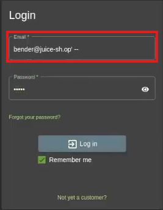
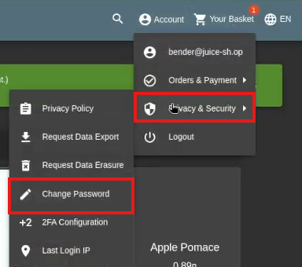
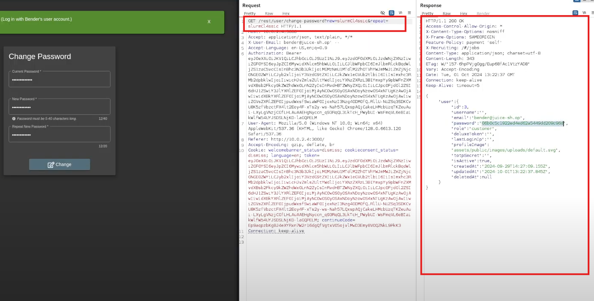
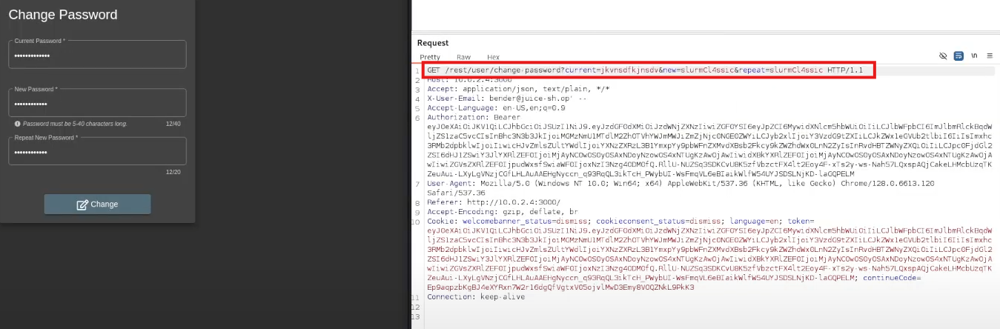

# OWASP Juice Shop Hacking: Password Reset Exploit

## Table of Contents

1. [Challenge Overview](#challenge-overview)
2. [Solution Steps](#solution-steps)
   - [Step 1: Login with SQL Injection](#step-1-login-with-sql-injection)
   - [Step 2: Initiate Password Reset](#step-2-initiate-password-reset)
   - [Step 3: Modify Request in Burp Suite](#step-3-modify-request-in-burp-suite)
   - [Step 4: Complete the Challenge](#step-4-complete-the-challenge)
3. [Video Tutorial](#video-tutorial)

## Challenge Overview

This challenge involves exploiting the password reset functionality in OWASP Juice Shop. By using SQL injection to bypass authentication and modifying the password reset request in Burp Suite, you can complete the challenge.

## Solution Steps

### Step 1: Login with SQL Injection

- In the login screen, enter the following as the email:
  ```bash
  bender@juice-sh.op'--
  ```
- Leave the password field empty.
- This SQL injection allows you to bypass the login process and access Bender's account.



### Step 2: Initiate Password Reset

- Once logged in, navigate to the user account section where you can reset the password.
- Enter the new password and submit the request.



### Step 3: Modify Request in Burp Suite

- Open Burp Suite and intercept the request when you submit the password reset form.
- Modify the parameters in the request:
  - Delete the "current password" parameter.
  - Keep the "new password" and "repeat new password" fields.
- Send the modified request through Burp Suite’s Repeater feature to bypass the current password requirement.




### Step 4: Complete the Challenge

- If the modified request is successfully processed, the password will be changed, and you will complete the challenge.

## Video Tutorial

For a detailed video tutorial on how to complete this challenge, watch the following videos:

[](https://drive.google.com/drive/folders/1ACwk1_sDCVEhfqRcqq-_Al0VCFSSfhQV?usp=sharing)

## Images of the hacking progress

---

By following these steps, you will successfully exploit the password reset functionality and complete the Juice Shop challenge.
