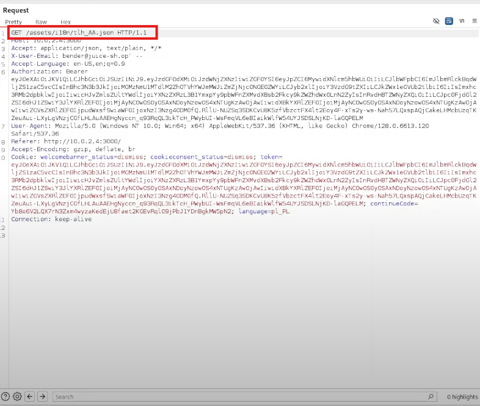
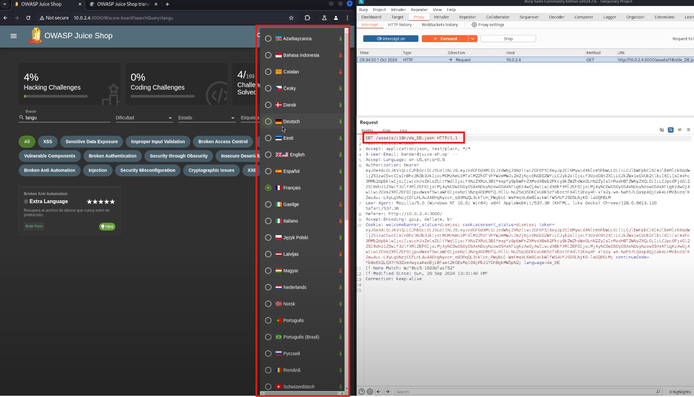

# OWASP Juice Shop Hacking: Language Manipulation Challenge

## Table of Contents

1. [Challenge Overview](#challenge-overview)
2. [Solution Steps](#solution-steps)
   - [Step 1: Select Language](#step-1-select-language)
   - [Step 2: Monitor Traffic with Burp Suite](#step-2-monitor-traffic-with-burp-suite)
   - [Step 3: Identify and Modify Language Header](#step-3-identify-and-modify-language-header)
   - [Step 4: Find Klingon Language Code](#step-4-find-klingon-language-code)
   - [Step 5: Complete the Challenge](#step-5-complete-the-challenge)
   - [Step 6: Bonus Step: Brute Forcing](#step-6-bonus-step-brute-forcing)
3. [Video Tutorial](#video-tutorial)

## Challenge Overview

This challenge involves changing the language settings in OWASP Juice Shop to an unsupported or hidden language (Klingon). By modifying the request headers and analyzing the available languages, you will complete the challenge.

## Solution Steps

### Step 1: Select Language

- In the OWASP Juice Shop application, go to the top-right corner where you can select the language.
- This dropdown will give you access to the available language options.

### Step 2: Monitor Traffic with Burp Suite

- Open Burp Suite and intercept the traffic between the client and server.
- Navigate through the Juice Shop application while Burp Suite is active and capturing HTTP requests.

### Step 3: Identify and Modify Language Header

- Once you have intercepted a request, check the HTTP headers.
- Find the `Accept-Language` header and note the value. This is where the language information is being passed.

### Step 4: Find Klingon Language Code

- Use Google to search for a list of supported languages in Juice Shop.
- Compare the list you found with the languages visible in the Juice Shop’s dashboard.
- Hover over the language flags, and you will eventually find Klingon (represented as `tlh_AA`).
- Modify the `Accept-Language` header in Burp Suite to use `tlh_AA`.

### Step 5: Complete the Challenge

- Once the request has been made with the updated Klingon language header, Juice Shop will respond with a JSON object.
- If everything is done correctly, you will complete the challenge and see the success message.

### Step 6: Bonus Step: Brute Forcing

- As an additional challenge, you can attempt brute-forcing other characters or language codes to find any hidden or unsupported languages.

## Video Tutorial

For a step-by-step video tutorial on how to complete this challenge, watch the following video on Google Drive:

[Watch the challange on Google Drive](https://drive.google.com/drive/folders/1ACwk1_sDCVEhfqRcqq-_Al0VCFSSfhQV?usp=sharing)

## Images of the hacking progress

---

This guide provides the essential steps to solve the Juice Shop language manipulation challenge, with an additional brute force option for exploring other hidden languages.
