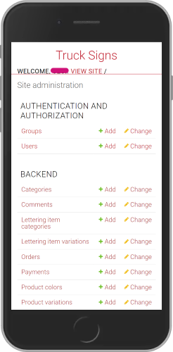
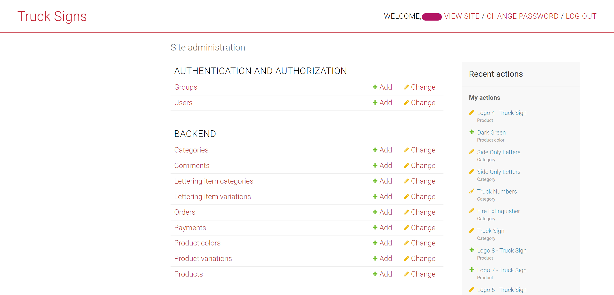
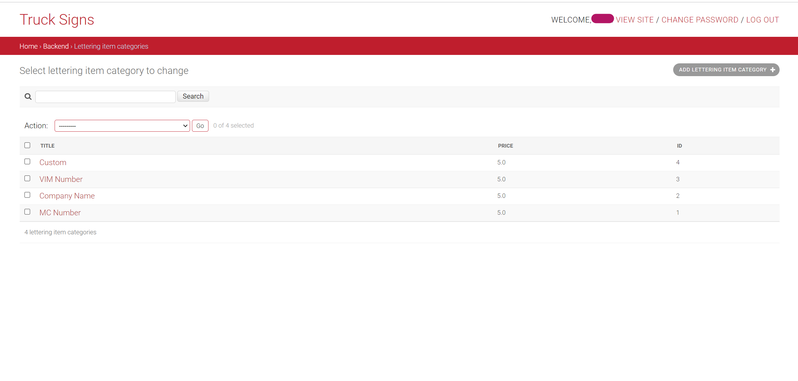
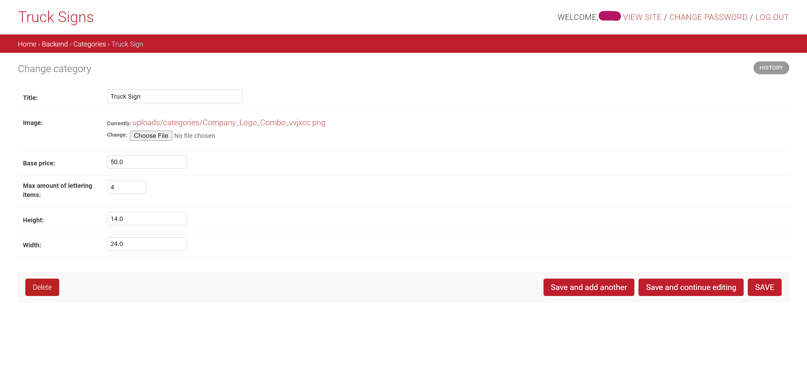

# Project: Truck Signs API with Docker

<div align="center">


  

</div>

## Table of Contents

1. [Description](#description)
2. [Installation](#installation)
3. [Project Overview](#project-overview)
4. [Useful Links](#useful-links)
5. [Screenshots of the Django Backend Admin Panel](#screenshots)

## Description

**Signs for Trucks** is an online store to buy pre-designed vinyls with custom lines of letters (often called truck letterings). The store also allows clients to upload their own designs and to customize them on the website as well. Aside from the vinyls that are the main product of the store, clients can also purchase simple lettering vinyls with no truck logo, a fire extinguisher vinyl, and/or a vinyl with only the truck unit number (or another number selected by the client).

### Settings

The **settings** folder inside the trucks_signs_designs folder contains the different settings configurations for each environment (so far the environments are development, docker testing, and production). These files are extensions of the base.py file which contains the basic configuration shared among the different environments (for example, the value of the template directory location). In addition, the .env file inside this folder has the environment variables that are mostly sensitive information and should always be configured before use. By default, the environment in use is the docker testing. To change between environments modify the `__init__.py` file.

### Models

Most of the models do what can be inferred from their name. The following notes clarify the purpose of some of the models:

- **Category Model:** The category of the vinyls in the store. It contains the title of the category as well as the basic properties shared among products that belong to the same category. For example, _Truck Logo_ is a category for all vinyls that have a logo of a truck plus some lines of letterings (note that the vinyls are instances of the model _Product_). Another category is _Fire Extinguisher_, which is for all vinyls that have a logo of a fire extinguisher.
- **Lettering Item Category:** This is the category of the lettering, for example: _Company Name_, _VIM NUMBER_, etc. Each has different pricing.
- **Lettering Item Variations:** This contains a foreign key to the **Lettering Item Category** and the text added by the client.
- **Product Variation:** This model has the original product as a foreign key, plus the lettering lines (instances of the **Lettering Item Variations** model) added by the client.
- **Order:** Contains the cart (in this case the cart is just a vinyl as only one product can be purchased at a time). It also contains the contact and shipping information of the client.
- **Payment:** It has the payment information such as the time of the purchase and the client id in Stripe.

To manage the payments, the payment gateway in use is [Stripe](https://stripe.com/).

### Brief Explanation of the Views

Most of the views are CBV imported from _rest_framework.generics_, and they allow the backend API to do the basic CRUD operations expected. Therefore, they inherit from the _ListAPIView_, _CreateAPIView_, _RetrieveAPIView_, etc.

The behavior of some of the views had to be modified to address functionalities such as the creation of orders and payments. For example, both functionalities are implemented in the same view, so a _GenericAPIView_ was the view from which it inherits. Another example is the _UploadCustomerImage_ view, which takes the vinyl template uploaded by the clients and creates a new product based on it.

## Installation

1. Clone the repository:
   ```bash
   git clone <INSERT URL>
   ```
1. Configure the environment variables.

   1. Copy the content of the example env file that is inside the `truck_signs_designs/settings` folder into a `.env` file:
      ```bash
      cd truck_signs_designs/settings
      cp simple_env_config.env .env
      ```
   1. Update the `.env` file with the necessary environment variables:

      ```bash
      SECRET_KEY=your_secret_key_here
      DB_NAME=trucksigns_db
      DB_USER=trucksigns_user
      DB_PASSWORD=supertrucksignsuser!
      DB_HOST=postgres_container
      DB_PORT=5432
      STRIPE_PUBLISHABLE_KEY=your_stripe_publishable_key_here
      STRIPE_SECRET_KEY=your_stripe_secret_key_here
      EMAIL_HOST_USER=your_email@example.com
      EMAIL_HOST_PASSWORD=your_email_password_here
      DJANGO_SUPERUSER_USERNAME=admin
      DJANGO_SUPERUSER_EMAIL=admin@example.com
      DJANGO_SUPERUSER_PASSWORD=adminpassword
      ```

   1. The `SECRET_KEY` is the Django secret key. To generate a new one, see: [Stackoverflow Link](https://stackoverflow.com/questions/41298963/is-there-a-function-for-generating-settings-secret-key-in-django).

## Docker Commands

### Create Docker Volumes and Network

To create the necessary Docker volumes for data storage and the Docker network, run the following commands:

1. **Create volumes for PostgreSQL data, media files, and static files:**

   ```bash
   docker volume create postgres_data
   docker volume create media_volume
   docker volume create static_volume
   ```

2. **Create a Docker network:**

   ```bash
   docker network create truck_signs_network
   ```

### Start PostgreSQL Container

To start the PostgreSQL container, run the following command, ensuring that it uses the same network and volumes as configured:

```bash
docker run --name postgres_container  \
   --network truck_signs_network  \
   -e POSTGRES_PASSWORD=supertrucksignsuser!  \
   -e POSTGRES_USER=trucksigns_user \
   -e POSTGRES_DB=trucksigns_db \
   -v postgres_data:/var/lib/postgresql/data   \
   -d postgres:latest
```

### Build and Start Your Django Container

After setting up the PostgreSQL container, you can build and start your Django container with the following commands:

1. **Build the Docker image:**

   Make sure you're in the root directory of the project (where the Dockerfile is located) and run:

   ```bash
   docker build -t truck_signs .
   ```

2. **Run the Django container:**

   ```bash
   docker run --name truck_signs_container \
   --network truck_signs_network \
    -p 8020:8020 \
    -v media_volume:/app/media \
    -v static_volume:/app/static \
    --env-file=truck_signs_designs/settings/.env \
    --restart on-failure \
    truck_signs:latest
   ```

This command maps port `8020` on your local machine to port `8020` in the Docker container, uses the `.env` file to set up all necessary environment variables, and ensures that media and static files are stored in the appropriate Docker volumes.

## Project Overview

This section covers the Truck Signs API project. Ensure all relevant details about the API, its setup, and usage are documented here.

### Technologies

- Python 3.8.10
- Django 2.2.8
- Django Rest Framework 3.12.4
- Docker

## Useful Links

### Docker

- [Docker Official Documentation](https://docs.docker.com/)
- Dockerizing Django, PostgreSQL, guinicorn, and Nginx:
  - Github repo of sunilale0: [Link](https://github.com/sunilale0/django-postgresql-gunicorn-nginx-dockerized/blob/master/README.md#nginx)
  - Michael Herman article on testdriven.io: [Link](https://testdriven.io/blog/dockerizing-django-with-postgres-gunicorn-and-nginx/)

### Postgresql Database

- Setup Database: [Digital Ocean Link for Django Deployment on VPS](https://www.digitalocean.com/community/tutorials/how-to-set-up-django-with-postgres-nginx-and-gunicorn-on-ubuntu-16-04)

### Django and DRF

- [Django Official Documentation](https://docs.djangoproject.com/en/4.0/)
- Generate a new secret key: [Stackoverflow Link](https://stackoverflow.com/questions/41298963/is-there-a-function-for-generating-settings-secret-key-in-django)
- Modify the Django Admin:
  - Small modifications (add searching, columns, ...): [Link](https://realpython.com/customize-django-admin-python/)
  - Modify Templates and css: [Link from Medium](https://medium.com/@brianmayrose/django-step-9-180d04a4152c)
- [Django Rest Framework Official Documentation](https://www.django-rest-framework.org/)
- More about Nested Serializers: [Stackoverflow Link](https://stackoverflow.com/questions/51182823/django-rest-framework-nested-serializers)
- More about GenericViews: [Testdriver.io Link](https://testdriven.io/blog/drf-views-part-2/)

### Miscellaneous

- Create Virtual Environment with Virtualenv and Virtualenvwrapper: [Link](https://docs.python-guide.org/dev/virtualenvs/)
- [Configure CORS](https://www.stackhawk.com/blog/django-cors-guide/)
- [Setup Django with Cloudinary](https://cloudinary.com/documentation/django_integration)

## Screenshots of the Django Backend Admin Panel

### Mobile View

<div align="center">

  

</div>

### Desktop View






