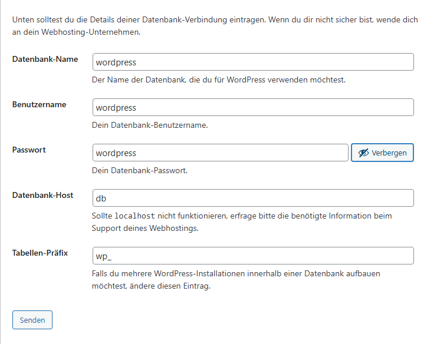
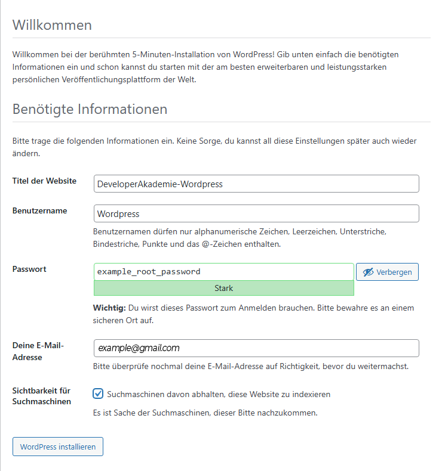

# Project: WordPress Setup with Docker

<div align="center">

 

</div>

## Table of Contents

1. [Description](#description)
2. [Prerequisites](#prerequisites)
3. [Quickstart Guide](#quickstart-guide)
4. [Usage](#usage)
5. [Useful Links](#useful-links)

## Description

This repository contains the configuration and setup files for running a WordPress server using Docker. The setup is designed to provide a seamless installation, with persistent data storage for the WordPress database and a pre-configured environment for easy deployment.

## Prerequisites

Before starting, make sure you have the following installed:

- Docker (version 20.10.8 or higher)
- Docker Compose
- A working internet connection
- Sufficient disk space for WordPress files and database storage

## Quickstart Guide

Follow these steps to quickly get your WordPress server up and running:

1. **Clone the repository**:

   ```bash
   git clone <REPOSITORY_URL>
   ```

2. **Navigate to the project directory**:

   ```bash
   cd wordpress-server
   ```

3. **Start the server**:
   Use Docker Compose to spin up the WordPress and database services:

   ```bash
   docker-compose up -d
   ```

4. **Access the WordPress Site**:
   Once the services are running, open your web browser and navigate to:

   - **URL**: `http://<IP-ADDRESS>:8080`

   Follow the setup instructions in the browser to configure your WordPress site.

5. **Troubleshooting**:

   If you encounter any issues, check the Docker logs for details:

   ```bash
   docker-compose logs
   ```

## Usage

This section details the configuration of the `docker-compose.yaml` and explains how to adjust the setup:

- **Environment Variables**:

  Before starting the server, create a `.env` file in the root directory of your project. This file stores the environment variables required for the WordPress and database configuration, such as database credentials and connection details.

  ### Example `.env` file

  ```env
  DB_HOST=db
  DB_USER=wordpress
  DB_PASSWORD=wordpress
  DB_NAME=wordpress
  MYSQL_ROOT_PASSWORD=example_root_password
  ```

- **Volumes**:  
  The configuration includes volume mounts to ensure that the database and WordPress content are stored persistently on your host system.

- **Networking**:  
  Both the `wordpress` and `db` services are configured to run within the same Docker network for seamless communication.

- **Restart Policy**:  
  The services will automatically restart if any unexpected errors occur, ensuring a stable setup.

## Images of the Setup




## Useful Links

- [WordPress Official Documentation](https://wordpress.org/support/)
- [Docker Documentation](https://docs.docker.com/)
- [How to Set Up WordPress with Docker](https://www.digitalocean.com/community/tutorials/how-to-set-up-wordpress-with-docker-compose)
